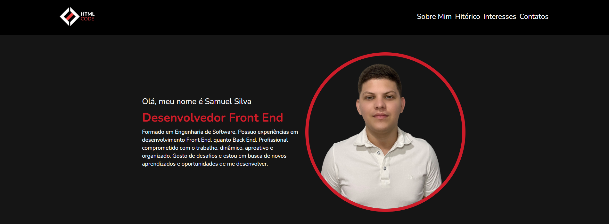

# Sobre o projeto

Portifolio reproduzido seguindo as orientações e o que foi estudado nas aulas do curso de Desenvolvimento Full Stack da Avanti.

O Portifolio fala um pouco sobre mim, meus interesses, minhas áreas de conhecimentos/habilidades, uma galeria de fotos onde é demonstrado as coisas das quais gosto, um pouco do meu aprendizado no curso e um formulário para entrar em contato.

## Layout

  

## Tecnologias Utilizadas

Este projeto foi desenvolvido utilizando as seguintes tecnologias:

- [HTML](https://developer.mozilla.org/pt-BR/docs/Web/HTML)
- [CSS](https://developer.mozilla.org/pt-BR/docs/Web/CSS)
- [TAILWIND](https://tailwindui.com/)

## Como Clonar o Projeto

1. Clone o repositório:

   ```bash
   git clone https://github.com/SamuelSilva-DEVL/projeto-final-avanti.git
   
2. Abra na sua IDE:

   Agora só abrir o index.html que vem dentro da pasta que você clonou no navegador para ter a visualização, e poder fazer a contribuição que quiser, ou usar como base para seu próprio portifólio.